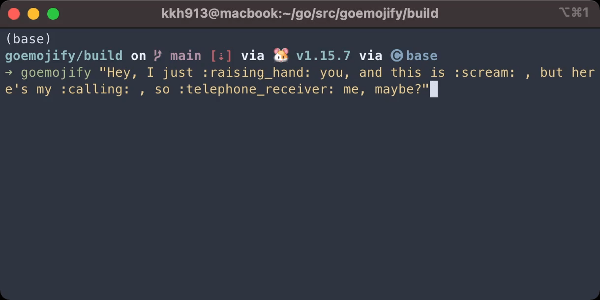
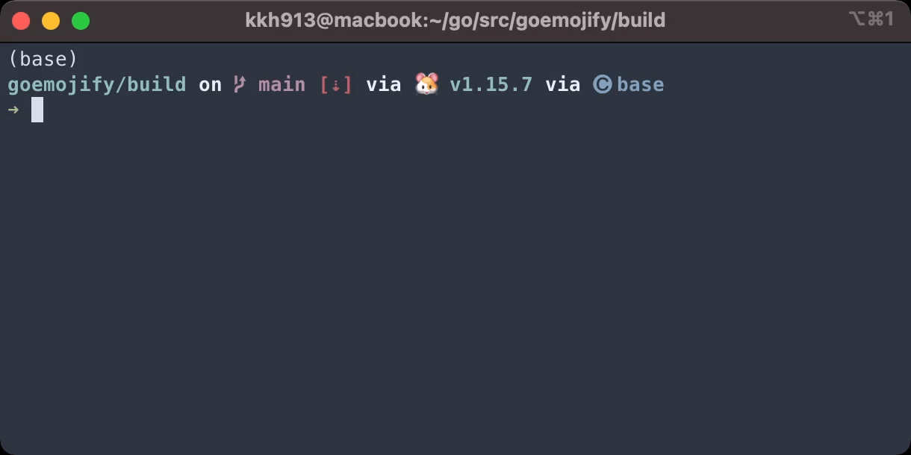

# goemojify

[](https://circleci.com/gh/kkh913/goemojify)

Convert the aliases to emoji raw characters. (e.g. `:+1:` → 👍)

## Installation

```
$ make
$ sudo cp build/goemojify /usr/local/bin 
```

## Dependencies

- [emoji.json](https://github.com/github/gemoji/blob/master/db/emoji.json): emoji data from gemoji (official?)
- [go-bindata](https://github.com/go-bindata/go-bindata): inject json into executable
- [json-iterator](https://github.com/json-iterator/go): High-Performance JSON Tool
- [cobra](https://github.com/spf13/cobra): Modern CLI

## Usage

Same as the original [use](https://github.com/mrowa44/emojify) except for the following:

1. I renamed the executable to `goemojify`.
2. Interactive is not supported. (Should I do it? 🤔) 

## Additional feature

1. `-f` string: convert aliases to emoji in text file

    ```bash
    $ goemojify -f emojify_tests.bats
    ```

## Example

1. Convert the string inside `""`

    

2. Use linux pipe

    

## Credits

It's a golang port of the original [emojify](https://github.com/mrowa44/emojify), all the glories should belong to [mrowa44](https://github.com/mrowa44).

## Thanks to

[@haukened](https://github.com/haukened/emojify): His project is also aimed at converting aliases to emojies in Go, which can be imported into the Go module. I was able to get some hints on regular expressions ([regexp](https://golang.org/pkg/regexp/)) from his project. I am not going to distribute this project as a Go module.

[@Nicola Apicella](https://dev.to/napicella/linux-pipes-in-golang-2e8j): Through his article I was able to learn how to use Linux pipe and cobra in Golang.

## TODOs 

- Release 
- Optimazation

## License

MIT
